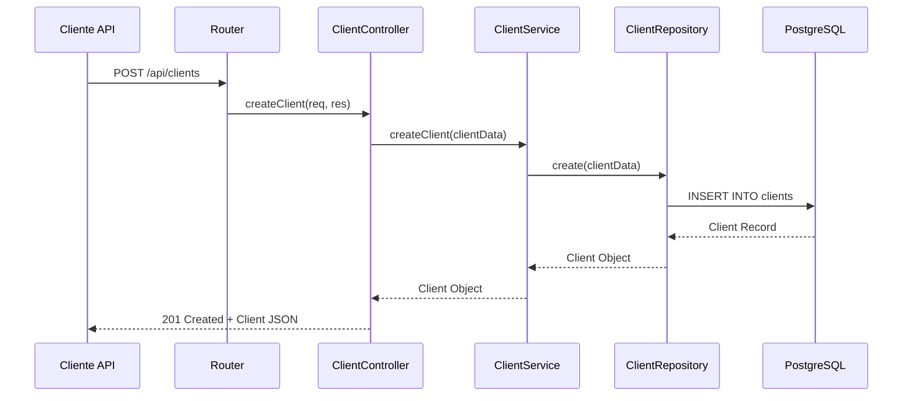
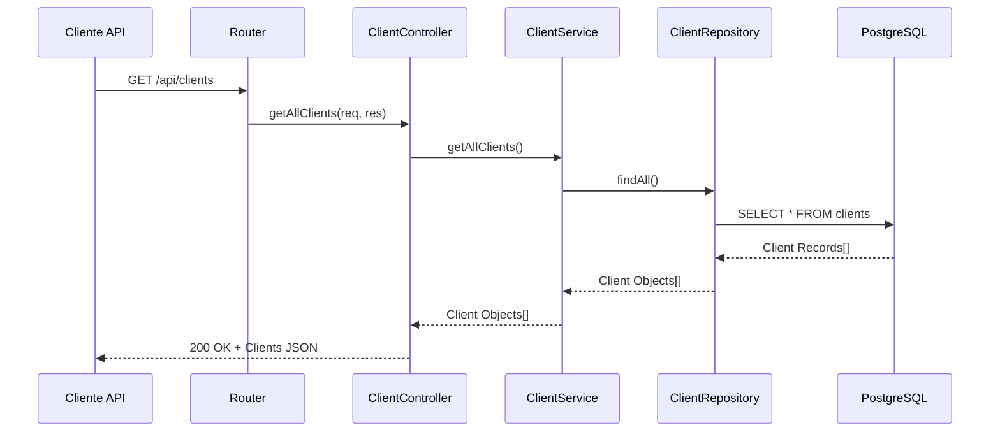
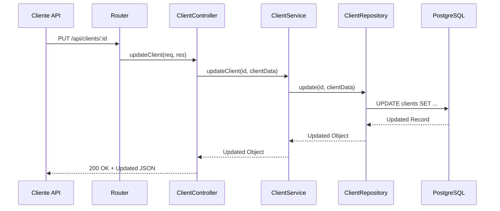
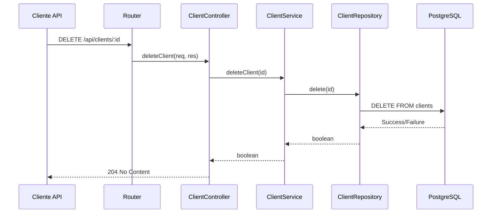
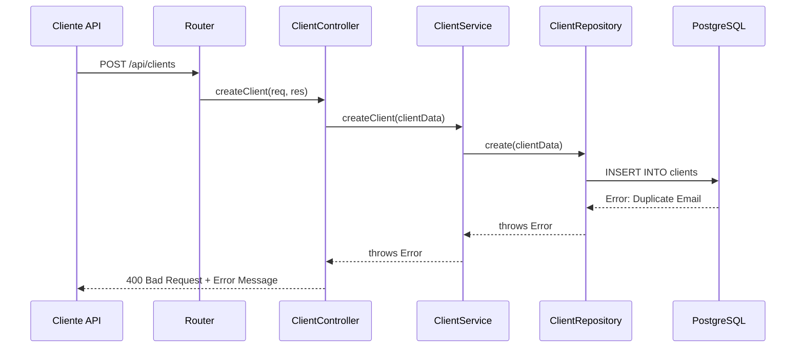
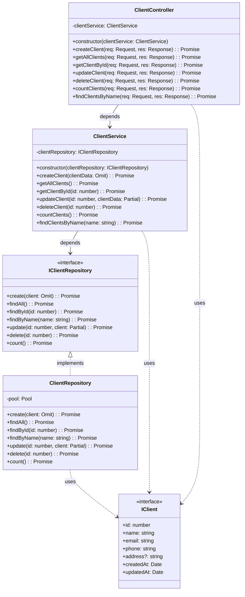

# Bootcamp: Arquiteto(a) de Software
## Desafio Final

# Objetivos de Ensino
Exercitar os seguintes conceitos trabalhados nos Módulos:

1. Fundamentos de Arquitetura de Software.
2. Requisitos Arquiteturais e Modelagem Arquitetural.
3. Design Patterns, Estilos e Padrões Arquiteturais.
4. Principais Arquiteturas de Software da Atualidade.

# Enunciado

Você é Arquiteto(a) de Software em uma grande empresa de vendas on-line.
Você é responsável por construir e implantar uma solução que disponibilize dados de Cliente/Produto/Pedido (algum domínio) aos parceiros da empresa.

Para isso, você vai Projetar, Documentar e Implantar uma API REST, no padrão arquitetural MVC, que exponha um endpoint capaz de realizar um CRUD dos dados (e um pouco mais).

# Executando

## Construir e iniciar os containers
```bash
docker compose up -d
```

## Ver os logs

### Todos os logs
```bash
docker compose logs -f
```

### Apenas logs da API
```bash
docker compose logs -f api
```

### Apenas logs do banco
```bash
docker compose logs -f postgres
```

### Apenas logs do banco
```bash
docker compose logs -f postgres
```

## Parar os containers
```bash
docker compose down
```

# Algumas observações importantes:

1. O serviço postgres tem um healthcheck que garante que o banco esteja pronto antes de iniciar a API
2. O depends_on com condition: service_healthy garante que a API só inicia quando o PostgreSQL estiver saudável
3. Os volumes permitem que as alterações no código sejam refletidas imediatamente (hot-reload)
4. A rede app-network permite que os containers se comuniquem
5. O DB_HOST na API aponta para o nome do serviço postgres
6. Os volumes persistem os dados do PostgreSQL entre reinicializações

# Para testar se está tudo funcionando:

## Iniciar os serviços
```bash
docker compose up -d
```

## Verificar status
```bash
docker compose ps
```

# Testar a API (em um terminal bash)

## Criar um cliente
```bash
curl -X POST http://localhost:3000/api/clients \
    -H "Content-Type: application/json" \
    -d '{"name":"João Silva","email":"joao@email.com","phone":"11999999999","address":"Rua Exemplo, 123"}'
```

## Listar todos os clientes
```bash
curl http://localhost:3000/api/clients
```

## Buscar cliente por ID
```bash
curl http://localhost:3000/api/clients/1
```

## Buscar cliente por nome
```bash
curl http://localhost:3000/api/clients/search\?name\=João
```

## Atualizar cliente
```bash
curl -X PUT http://localhost:3000/api/clients/1 \
    -H "Content-Type: application/json" \
    -d '{"name":"João Silva Atualizado","email":"joao.novo@email.com"}'
```

## Deletar cliente
```bash
curl -X DELETE http://localhost:3000/api/clients/1
```

## Contar total de clientes
```bash
curl http://localhost:3000/api/clients/count
```

## Se precisar reconstruir a imagem da API após alterações no Dockerfile:
```bash
docker compose build api
docker compose up -d
```

> Com essa configuração, teremos tanto o banco de dados quanto a API rodando em containers Docker, com hot-reload para desenvolvimento e persistência de dados.

## Documentação da API
A documentação completa da API está disponível através do Swagger UI em:
```bash
http://localhost:3000/api-docs
```

Para acessar:
1. Inicie os containers: `docker compose up -d`
2. Abra o navegador e acesse: http://localhost:3000/api-docs
3. Explore e teste os endpoints diretamente pela interface do Swagger

# Stack Tecnológica

## Backend
- **Node.js** - Ambiente de execução JavaScript
- **TypeScript** - Superset tipado do JavaScript
- **Express.js** - Framework web para Node.js
- **PostgreSQL** - Banco de dados relacional
- **Docker** - Plataforma de containerização

## Principais Dependências
- **pg** - Cliente PostgreSQL para Node.js
- **dotenv** - Gerenciamento de variáveis de ambiente
- **nodemon** - Reinicialização automática do servidor em desenvolvimento

## Ferramentas de Desenvolvimento
- **TypeScript** - Linguagem principal
- **ts-node** - Execução de TypeScript
- **Docker Compose** - Orquestração de containers
- **ESLint** - Linter para identificar problemas no código
- **Prettier** - Formatador de código

## Arquitetura
- Padrão MVC (Model-View-Controller)
- Arquitetura em Camadas:
  - **Controllers**: Manipulação das requisições HTTP
  - **Services**: Lógica de negócio
  - **Repositories**: Acesso ao banco de dados
  - **Models**: Entidades do domínio
  - **Interfaces**: Contratos e tipos
  - **Routes**: Definição das rotas da API
  - **Config**: Configurações da aplicação
  - **Utils**: Utilitários e helpers

## Estrutura do Projeto
```typescript
src/
  ├── app.ts                 # Configuração do Express
  ├── server.ts              # Entrada da aplicação
  ├── config/               
  │   └── database.ts        # Configuração do PostgreSQL
  ├── controllers/
  │   └── ClientController.ts # Controlador de Clientes
  ├── interfaces/
  │   ├── IClient.ts         # Interface do Cliente
  │   └── IClientRepository.ts # Interface do Repositório
  ├── models/
  │   └── Client.ts          # Modelo de Cliente
  ├── repositories/
  │   └── ClientRepository.ts # Repositório de Clientes
  ├── routes/
  │   ├── clientRoutes.ts    # Rotas de Cliente
  │   └── index.ts           # Agregador de rotas
  ├── services/
  │   └── ClientService.ts   # Serviço de Cliente
  └── utils/
      └── createTables.ts    # Utilitário de criação de tabelas
```

# Arquitetura C4
Usando **DSL** [link para o Structurizr](https://structurizr.com/dsl).

## Nível 1 - Diagrama de Contexto

```c4
workspace {
    model {
        user = person "Cliente API" "Consumidor dos serviços da API"
        
        softwareSystem = softwareSystem "Sistema de Gerenciamento de Clientes" {
            description "Sistema que fornece APIs RESTful para gerenciamento de clientes"
            
            apiApplication = container "API de Clientes" {
                description "API REST que fornece funcionalidades de CRUD para clientes"
                technology "Node.js, Express, TypeScript"
            }
            
            database = container "Banco de Dados" {
                description "Armazena informações dos clientes"
                technology "PostgreSQL"
            }
        }

        # Relacionamentos
        user -> apiApplication "Faz requisições REST API" "HTTP/JSON"
        apiApplication -> database "Lê e escreve" "SQL/TCP"
    }

    views {
        systemContext softwareSystem "SystemContext" {
            include *
            autoLayout
        }

        styles {
            element "Software System" {
                background #1168bd
                color #ffffff
            }
            element "Person" {
                shape person
                background #08427b
                color #ffffff
            }
            element "Container" {
                background #438dd5
                color #ffffff
            }
        }
    }
}
```

### Elementos do Diagrama

1. **Cliente API (Person)**
   - Consumidor externo que interage com o sistema
   - Faz requisições HTTP para gerenciar dados de clientes

2. **Sistema de Gerenciamento de Clientes (Software System)**
   - Sistema principal que gerencia todas as operações relacionadas a clientes
   - Composto por API REST e banco de dados

3. **API de Clientes (Container)**
   - Aplicação Node.js com Express e TypeScript
   - Implementa endpoints RESTful para CRUD de clientes
   - Segue padrão arquitetural MVC

4. **Banco de Dados (Container)**
   - PostgreSQL para persistência dos dados
   - Armazena informações dos clientes
   - Gerenciado via Docker

### Relacionamentos

1. **Cliente API → API de Clientes**
   - Protocolo: HTTP/JSON
   - Operações CRUD via endpoints REST

2. **API de Clientes → Banco de Dados**
   - Protocolo: SQL/TCP
   - Persistência e recuperação de dados

## Nível 2 - Diagrama de Container

```c4
workspace {
    model {
        # Pessoas
        user = person "Cliente API" "Consumidor dos serviços da API"

        clientSystem = softwareSystem "Sistema de Gerenciamento de Clientes" {
            # API Containers
            webApi = container "API Express" {
                description "Fornece funcionalidades de CRUD via JSON/HTTP"
                technology "Node.js, Express, TypeScript"
            }

            clientController = container "Controller Layer" {
                description "Manipula requisições HTTP e respostas"
                technology "TypeScript, Express Router"
            }

            clientService = container "Service Layer" {
                description "Implementa lógica de negócio"
                technology "TypeScript"
            }

            clientRepository = container "Repository Layer" {
                description "Gerencia acesso e persistência de dados"
                technology "TypeScript, node-postgres"
            }

            # Database Container
            databaseContainer = container "Database" {
                description "Armazena e gerencia dados dos clientes"
                technology "PostgreSQL 15"
                tags "database"
                
                properties {
                    "Schema" "clients"
                    "Tables" "clients (id, name, email, phone, address, created_at, updated_at)"
                    "Indexes" "PK_clients, IDX_clients_email, IDX_clients_name"
                }
            }
        }

        # Relacionamentos
        user -> webApi "Faz requisições" "HTTP/JSON"
        
        # Fluxo interno
        webApi -> clientController "Roteia requisições" "Express Router"
        clientController -> clientService "Invoca" "TypeScript"
        clientService -> clientRepository "Usa" "TypeScript"
        clientRepository -> databaseContainer "Persiste dados" "SQL via node-postgres pool"
    }

    views {
        container clientSystem "Containers" {
            include *
            autoLayout
        }

        styles {
            element "Person" {
                shape person
                background #08427b
                color #ffffff
            }
            element "Container" {
                background #438dd5
                color #ffffff
            }
            element "database" {
                shape cylinder
                background #438dd5
                color #ffffff
            }
        }

        themes default
    }
}
```

### Detalhamento do Container de Banco de Dados

O container `Database` é responsável por:

1. **Persistência**
   - Armazenamento dos dados dos clientes
   - Garantia de integridade referencial
   - Gerenciamento de índices e constraints

2. **Estrutura**
   - Tabela `clients` com campos estruturados
   - Triggers para atualização automática
   - Índices para otimização de consultas

3. **Comunicação**
   - Conexão via pool de conexões
   - Protocolo PostgreSQL nativo
   - Porta 5432 exposta via Docker

4. **Features**
   - Transações ACID
   - Índices automáticos e customizados
   - Constraints de unicidade
   - Timestamps automáticos


## Diagramas de Sequência UML
Usando **mermaid** [link para o Mermaid Chart](https://www.mermaidchart.com/play?utm_source=mermaid_live_editor&utm_medium=toggle).

### Criar Cliente


### Buscar Todos Clientes


### Atualizar Cliente


### Deletar Cliente


### Tratamento de Erro


Estes diagramas mostram:
1. O fluxo completo das requisições
2. A interação entre as camadas
3. Os tipos de retorno
4. O tratamento de erros
5. Os status HTTP retornados

## Diagrama de Classes UML



### Descrição das Classes

1. **IClient**
   - Interface que define a estrutura de um cliente
   - Contém todas as propriedades necessárias
   - Usada para tipagem em toda a aplicação

2. **IClientRepository**
   - Interface que define os métodos do repositório
   - Define o contrato para acesso aos dados
   - Permite diferentes implementações (PostgreSQL, MongoDB, etc.)

3. **ClientRepository**
   - Implementação concreta do IClientRepository
   - Usa node-postgres para acesso ao banco
   - Implementa todas as operações CRUD

4. **ClientService**
   - Contém a lógica de negócio
   - Usa injeção de dependência do repositório
   - Implementa validações e regras de negócio

5. **ClientController**
   - Manipula requisições HTTP
   - Converte dados entre HTTP e domínio
   - Gerencia respostas e códigos de status

### Relacionamentos

1. **Implementação**
   - ClientRepository implementa IClientRepository
   - Garante que todos os métodos necessários estão implementados

2. **Dependência**
   - ClientService depende de IClientRepository (inversão de dependência)
   - ClientController depende de ClientService
   - Todas as classes usam IClient para tipagem

3. **Composição**
   - ClientRepository possui uma instância de Pool (conexão DB)
   - ClientService possui uma instância de IClientRepository
   - ClientController possui uma instância de ClientService
